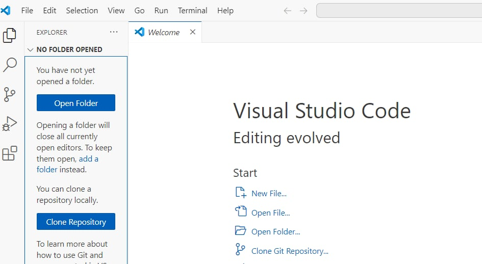

# 🖥️ Въведение - Типове данни и оператори. Потоци за вход и изход std::cin, std::cout


### ☠️ **Всеки ред завършва с ;** ☠️

## Как да стартираме първата ни програма?
Отваряте `VS Code` и с клавишната комбинация `Ctrl + Shift + E` отваряме Explorer (Или натискаме най-горната иконка на менюто в дясно).



Натискаме `Open Folder` и влизате в папката, в която ще си съхранявате програмите от семестъра.

С десен бутон `New file`създайте файл на име `main.cpp` и напишете следния код:

```cpp
#include<iostream>

int main(){
   std::cout << "Hello world!" ;
}
```

С клавишната комбинация `Ctrl + j` отваряме терминал. В терминала въвеждаме:
```
g++ main.cpp
```

Когато искате да компилирате програма пишете `g++` и **името на файла**, който искаме да компилираме.

След това пишете `a`, натискате бутона `tab`, трябва да се изпише `a.exe`, накрая натискате e `enter`

## Отпечатване на данни със std::cout

**`std::cout`** е стандартен обект за изход в C++, който се използва за отпечатване на данни на конзолата. Той е част от библиотеката **`<iostream>`**, която трябва да бъде включена в началото на програмата.

Синтаксисът за използване на `std::cout` е следният:

```cpp
std::cout << израз;
```

### Отпечатване на цели числа
```cpp
#include <iostream>
using namespace std;

int main() {
    int num = 42;
    cout << "The value of num is " << num << endl;
    return 0;
}
```

### Отпечатване на дробни числа
```cpp
#include <iostream>
using namespace std;

int main() {
   double pi = 3.14159;
   std::cout << "The value of Pi is: " << pi << endl;
}

```

### Oтпечатване на символи

```cpp
#include <iostream>

int main() {
   char letter = 'A';
   std::cout << "The letter is : " << letter << endl;
}

```

### Отпечатване на повече от една променлива

```cpp
#include <iostream>

int main() {
   int length = 10;
   int width = 2;

   std::cout << "The width of the rectangle is: " << width << " and the length is " << length << std:: endl;
}

```

`std::endl` отпечатва **нов ред**. 

 
## Въвеждане на данни със std::cin
```cpp
#include<iostream>

int main(){
   int a;
   //Въвеждаме от клавиатурата стойност за а
   std::cin >> a;
}
```
## Задачи 
**Задача 1:** Въвежда се цяло число. Да се отпечата без последната цифра.  
``` 
   Вход : 1234  
   Изход: 123
```

**Задача  2:** 🔢 Въвеждат се две цели числа. Да се изведе тяхната сума, разлика, произведение, частно и остатък.
```  
Вход : 12 3  
Изход:  
    Сума: 15  
    Разлика: 9  
    Произведение: 36  
    Частно: 4  
    Остатък: 0

```

**Задача 3:** 🔧 Въвеждат се две числа - a и b. Да се изведе (a-b)^4 - (a+b)^2.
```  
Вход : 2 1  
Изход: 0
```` 

**Задача 4:** 📐 Въведени са три числа - страни на триъгълник. Да се изведе обиколката му.
```
Вход : 3 4 5  
Изход: 12
```

**Задача 5:** 🧮 Въвеждат се две числа - a и b, такива, че ах = b. Да се изведе стойността на х.
``` 
Вход : 5 25  
Изход: x = 5
```

**Задача 6:** Въвежда се четирицифрено число. Да се изведе сбора на цифрите му.
```
Вход : 1234  
Изход: 10
```


**Задача 7:** Въвежда се число - радиус на окръжност. Да се изведе обиколката и лицето ѝ. (Може да използвате константа за числото π)
 ``` 
Вход : 7  
Изход:  
   - Обиколка: 43.96  
   - Лице: 153.94
```


**Задача 8** Изведете следната фигура на конзолата:
```
  *
 ***
*****
```


**Задача 9:** Въвежда се 1 число от стандарния вход. Да се изведе `My age is`  и стойността на въведеното число.
 ```
Вход : 25  
Изход: My age is 25
```


**Задача 10:** ⚖️ Въвеждат се две числа. Да се изведе 1, ако първото е по-голямо от второто, в противен случай - 0.
```  
Вход  : 5 3  
Изход : 1
 ``` 


**Задача 11:** Въвежда се число. Да се изведе 1, ако е валидна училищна оценка, в противен случай - 0.
``` 
Вход : 4  
Изход: 1
```
